# CANA SiteMind competitor-to-creative evolution bridge

Status: `SITEMIND_COMPETITIVE_EVOLUTION_BRIDGE_PASSED`

This branch is an owner-gated, local-review-only bridge stacked on the rejected PR #21 homepage interface. It does not approve PR #21, create production authority, publish creative, spend money, contact merchants, or write production data. The three new candidates remain `OWNER_REVIEW_PENDING`.

## Architecture map

```mermaid
flowchart LR
  GW["CANA Sovereign Growth Watch handoff"] --> A["Validated untrusted sensor adapter"]
  CR["Competitor Crawl Intelligence handoff"] --> A
  A --> L["Single SiteMind competitor event ledger"]
  L --> E["Deterministic evidence receipt and cadence"]
  E --> M["Mechanism extraction, no copied expression"]
  O["PR #21 owner rejection and preference pair"] --> C["Canonical SiteMind context compiler"]
  M --> C
  C --> H["Existing Hermes governed packet"]
  H --> R["Provider-neutral ad-creative router"]
  R --> G["Three original responsive campaign systems"]
  G --> P["Actual homepage local review gate"]
  P --> T["14-judge visual tournament"]
  T --> D["Owner decision pending"]
  D --> X["Experiment defined, not run"]
  D --> LR["Canonical learning receipt and next-generation retrieval"]
```



The sensor adapters cannot write a second memory. Both converge on `sitemind/competitor-events.jsonl`, under the existing SiteMind ownership boundary. Search claims are discovery signals only; a matching direct crawl observation is required before fusion.

## Reused components

| Responsibility | Canonical component reused |
| --- | --- |
| Site intelligence ownership | `apps/web/src/lib/sitemind.mjs` boundary and the SiteMind-owned extension `sitemind-competitive-evolution.mjs` |
| Context compilation | `skills-src/sitemind-context-compiler.mjs` |
| Governed creative request and receipt | `skills-src/hermes-governed-packet.mjs` |
| Canonical hashing and mission assertions | `tools/mission-2/canonical.mjs` |
| Creative providers and verification home | `packages/ad-creative` |
| Customer billboard eligibility | `apps/web/src/lib/customer-banner.mjs` |
| Actual homepage placement | `apps/web/src/app/[domain]/page.tsx` and `customer-sponsored-banner.tsx` |

## Duplicate-system audit

| Prohibited duplicate | Result | Evidence |
| --- | --- | --- |
| CANA brain or governor | Not created | Hermes and mission assertions are imported from their canonical modules. |
| TruthGraph | Not created | No graph store, graph schema, or alternate truth resolver was added. |
| Site memory | Not created | One SiteMind competitor ledger and the existing context compiler are used. |
| Creative Foundry | Not created | Campaign routing lives inside the existing `packages/ad-creative` package. |
| Scheduler | Not created | The bridge accepts standardized handoffs; it does not schedule or run external tasks. |
| Paid or publishing authority | Not created | Every candidate is pending and the local review route is separate from the approved live selector. |

## Contracts and implementation

`COMPETITIVE_EVOLUTION_SCHEMAS` supplies the scheduled-task handoff, Growth Watch signal, crawl job, crawler observation, competitor event, evidence receipt, rights/provenance, creative record, preference pair, performance outcome, and learning receipt contracts. The complete serialized registry is retained at `evidence/competitive-evolution/pr21-owner-review/schemas.json`.

The implementation provides:

- strict scheduled-task adapters for `CANA Sovereign Growth Watch` and `Competitor Crawl Intelligence`;
- safe offline owner-packet import with manifest validation, content-addressed objects, metadata exclusion, size budgets, PNG validation, and traversal/symlink/hard-link/duplicate refusal;
- deterministic fusion and deduplication into one append-only, tenant- and workspace-scoped SiteMind ledger;
- a targeted crawl-job contract, evidence receipts, and change-rate/importance/failure/evidence-quality cadence routing;
- mechanism extraction that explicitly records `protected_expression_copied: false`;
- the canonical SiteMind context compiler and existing Hermes packet/receipt path;
- a provider registry that selects the zero-cost repository vector compositor and leaves Gemini blocked, with provider calls `0` and spend `$0`;
- three complete campaign records, six original repository-owned SVG assets, and desktop/mobile homepage renders;
- fourteen evidence-citing tournament judges, failure lists, critique overlays, lineage receipts, limitations, a pending owner control, and an unrun first-party experiment;
- a learning receipt plus generation-two retrieval proof that applies the rejected qualities without inventing an approved winner.

## Controlled vertical slice

The deterministic slice is run with:

```sh
/Users/Apple/.nvm/versions/node/v20.20.2/bin/node tools/competitive-evolution/run-pr21-vertical-slice.mjs \
  --owner-packet /Users/Apple/Downloads/ORDERWEEDDC_PR21_FINAL_OWNER_REVIEW_PACKET_5c7fe27 \
  --output evidence/competitive-evolution/pr21-owner-review
```

It preserves the rejected desktop and mobile billboard bytes at SHA-256 `e4ae17edd0cb2c4b6f2d68e3a719132c2bf59c238417ed8283d5688d1d795332` and `1b124691d8da52f05d3aada2ad009bb78d84439eeed9818fc7b68c2331c13f3d`, respectively. Imported text has no instruction authority.

The bridge fixture validates the offline handoff/fusion contract. It is explicitly not evidence of a current competitor behavior, adoption level, or performance outcome. No competitor network crawl is represented by the fixture.

## Owner review instructions

1. Open `evidence/competitive-evolution/pr21-owner-review/owner-review-contact-sheet.png` for the readable static comparison.
2. Open `owner-review.html` locally to inspect the same desktop/mobile pairs and download a decision template.
3. Review the actual-homepage captures under `renders/` and the campaign-specific scorecards under `campaigns/`.
4. Choose exactly one candidate or select `REJECT_ALL_REQUEST_CHANGES`.
5. Return the downloaded `owner-campaign-decision.json` as a new explicit owner directive. Do not edit `owner-decision-control.json` to simulate approval.

No selection is assumed in this PR. A later bounded change must validate and append the owner decision before any experiment, publishing, merge of the stacked dependency, spend, or production action can be considered.

## Courts and limitations

Deterministic tests cover safe and unsafe offline import, archive refusal, traversal, duplicate members, symlinks, hard links, oversize inputs, malformed PNGs, instruction-shaped text, scheduled handoff allowlisting, fusion, deduplication, rights state, authority refusal, tournament evidence, and learning retrieval. Browser courts cover desktop/mobile page context, isolated billboards, accessibility, overflow, console/request failures, customer-facing copy, and resource transfer evidence.

The scores do not prove customer preference, CTR, conversion lift, merchant value, ranking, revenue, or causal impact. The first-party experiment is `DEFINED_NOT_RUN`; all measured outcome fields remain null. The complete limitations ledger is `evidence/competitive-evolution/pr21-owner-review/limitations.json`.

The branch is intentionally stacked on PR #21 commit `5c7fe2707dcb2836ed62e1c3d9a01bb62cd50723` because the actual customer billboard interface exists there. PR #21 remains owner-rejected and must not be merged as a consequence of this work. This branch also must remain unmerged until its dependency and one candidate receive separate owner authorization.
