# Claim state machine

`MarketClaim` is versioned and append-only. Court outcomes never rewrite an earlier claim.

```mermaid
stateDiagram-v2
  [*] --> UNKNOWN: compiler appends claim plus evidence
  UNKNOWN --> VERIFIED: court ALLOW appends version
  UNKNOWN --> STALE: court MARK_STALE appends version
  UNKNOWN --> REFUTED: court detects tamper or unsupported value
  UNKNOWN --> CONTRADICTED: court PRESERVE_CONFLICT
  VERIFIED --> VERIFIED: new snapshot and independent approval append a newer version
  VERIFIED --> STALE: freshness boundary reached
  VERIFIED --> CONTRADICTED: current contradictory observation preserved
```

Public eligibility requires a `VERIFIED` version, `decisionEligible=true`, an exact identity resolution, source authority for the predicate, and an unexpired freshness window. A compatibility cohort additionally requires the four official predicates for the same source resolution and snapshot. Unsupported claim types remain UNKNOWN and ineligible even when they share a source record with approved claims.

Every court decision is an append-only `MarketVerificationEvent` bound to the evaluated claim and evidence digest. Evidence membership is append-only. Supersession points backward to retained history.
