# Phase B Slice 1 architecture

Slice 1 adds an evidence constitution beside the existing Geo kernel. It does not replace `GeoEntity`, `GeoEntityAlias`, or `GeoClaim`.

```mermaid
flowchart LR
  A["Committed DCGIS response bytes"] --> B["Immutable MarketSourceSnapshot"]
  B --> C["Tenant-scoped MarketCompilation"]
  C --> D["UNKNOWN MarketObservation plus exact resolution"]
  D --> E["Versioned UNKNOWN MarketClaim"]
  B --> F["Independent Verification Court"]
  E --> F
  F --> G["Append-only MarketVerificationEvent"]
  F --> H["New VERIFIED or STALE claim version"]
  H --> I["Field-scoped Retailer and GeoClaim compatibility projection"]
  I --> J["Strict public truth gate"]
  J --> K["ASK, map, discovery, SEO"]
  K --> L["Bounded MARKET_GAP recheck"]
  L --> M["Read-only Site Intelligence coverage"]
  M --> N["REFLECTION_ONLY owner-review receipt"]
```

The database owns eight append-only evidence tables: source snapshots, tenant compilations, observations, identity resolutions, versioned claims, claim-evidence membership, explicit contradictions, and court events. PostgreSQL triggers reject update and delete operations on all eight. Corrections and state changes append records.

The compiler and court are separate callable paths. The compiler never imports the court and cannot create verification events or public eligibility. The court rereads the exact stored payload, recomputes hashes and values, and creates a new claim version for an admitted or changed state. Legacy projections exist only to preserve existing product consumers and carry a one-to-one `marketClaimId` link.

One immutable source snapshot can be reused by multiple tenants, but each tenant receives a distinct compilation and claim history. Only the policy-owned `orderweeddc.com` tenant may update the shared compatibility projection; other tenants remain claim-scoped and read-only with respect to global retailer truth.

The ASK loop does not invent supply. A fired trigger is only a durable wake receipt and never grants truth authority by itself. The consumer verifies the entire receipt chain and exact mission, trigger, tenant, tick, and opportunity bindings before rechecking the canonical strict truth predicate. A positive current candidate closes the recorded gap and mission in the same serializable consumer transaction as its REFLECTED receipt; zero preserves the open opportunity. Site Intelligence only counts persisted states and emits observations. Reflection records a failed assumption and next owner action but promotes nothing.
