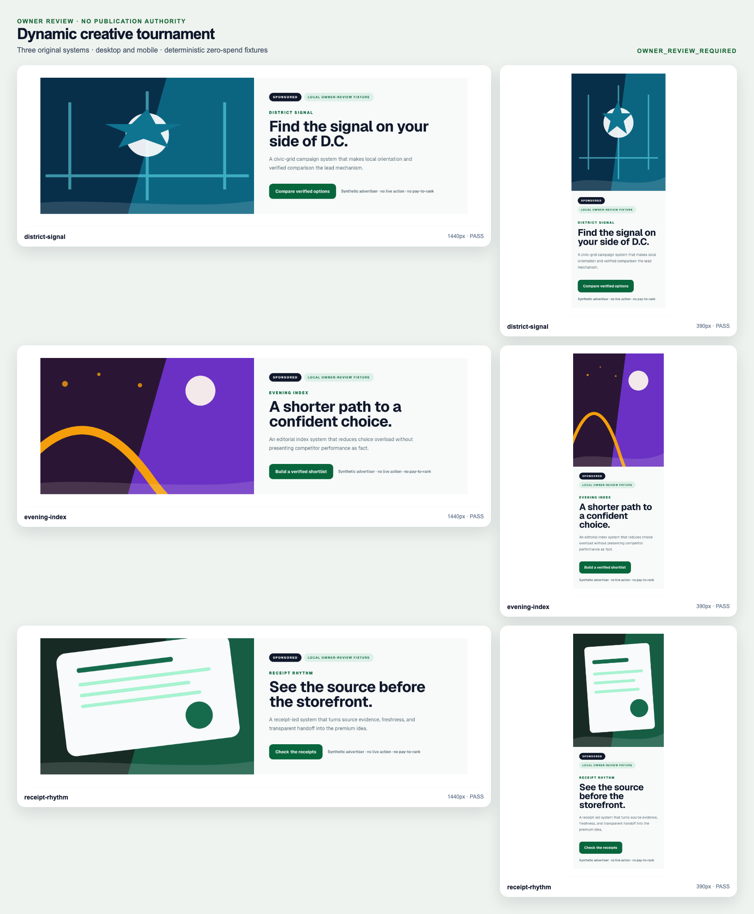

# Dynamic creative owner review

State: `OWNER_REVIEW_REQUIRED`

No candidate is approved by passing checks. Nothing in this packet authorizes merge, deployment, publication, provider spend, advertiser charge, campaign spend, cPanel access, or `prod.db` access.

The homepage links below are full 1440×1100 or 390×844 browser viewports with surrounding marketplace context. The isolated links are placement crops used by the contact sheet.

## Contact sheet

## Decision table

| System | Mechanism | Desktop | Mobile | Owner decision |
|---|---|---|---|---|
| District Signal | Local orientation | [actual homepage](./renders/district-signal-desktop-homepage.png) / [isolated](./renders/district-signal-desktop-lab.png) | [actual homepage](./renders/district-signal-mobile-homepage.png) / [isolated](./renders/district-signal-mobile-lab.png) | Pending |
| Evening Index | Bounded choice | [actual homepage](./renders/evening-index-desktop-homepage.png) / [isolated](./renders/evening-index-desktop-lab.png) | [actual homepage](./renders/evening-index-mobile-homepage.png) / [isolated](./renders/evening-index-mobile-lab.png) | Pending |
| Receipt Rhythm | Trust before handoff | [actual homepage](./renders/receipt-rhythm-desktop-homepage.png) / [isolated](./renders/receipt-rhythm-desktop-lab.png) | [actual homepage](./renders/receipt-rhythm-mobile-homepage.png) / [isolated](./renders/receipt-rhythm-mobile-lab.png) | Pending |
| Source Before Hype | Approved deterministic house fallback | [actual homepage](./renders/source-before-hype-desktop-homepage.png) | [actual homepage](./renders/source-before-hype-mobile-homepage.png) | Already approved primary seed |

## Owner controls

For each new system, record exactly one of:

- `APPROVE_AS_CREATIVE_GENOME_AND_HOUSE_FALLBACK`;
- `APPROVE_AS_CREATIVE_GENOME_ONLY`;
- `REQUEST_CHANGES` with reason tags;
- `REJECT` with reason tags.

The owner may approve different desktop/mobile refinements only if they remain one coherent campaign. Silence or passing checks means `PENDING`, never approval.

## Required receipts

- [PR21 rejected evidence admission](./pr21-rejected-evidence-ingestion.json)
- [Owner preference memory](./owner-preference-memory.json)
- [SiteMind context](./sitemind-context-receipt.json)
- [Hermes governed packet](./hermes-governed-packet.json)
- [Provider registry](./provider-registry.json) and [routing](./provider-routing-receipt.json)
- [Campaign state machine](./campaign-lifecycle.json)
- [Sponsorship entitlements](./entitlement-model.json)
- [Visual court](./visual-court.json)
- [Rejection and regeneration](./rejection-regeneration-receipt.json)
- [Fail-closed rollback](./rotation-rollback-receipt.json)
- [Performance event interfaces](./performance-event-schemas.json)
- [Defined but not run experiment](./first-party-experiment-plan.json)
- [Learning receipt](./learning-receipt.json)
- [Browser tournament](./renders/browser-tournament-receipt.json)
- [Clean ancestry](./ancestry-transfer-receipt.json)

The next generation must retrieve the recorded owner decision and reason labels before producing new candidates.
